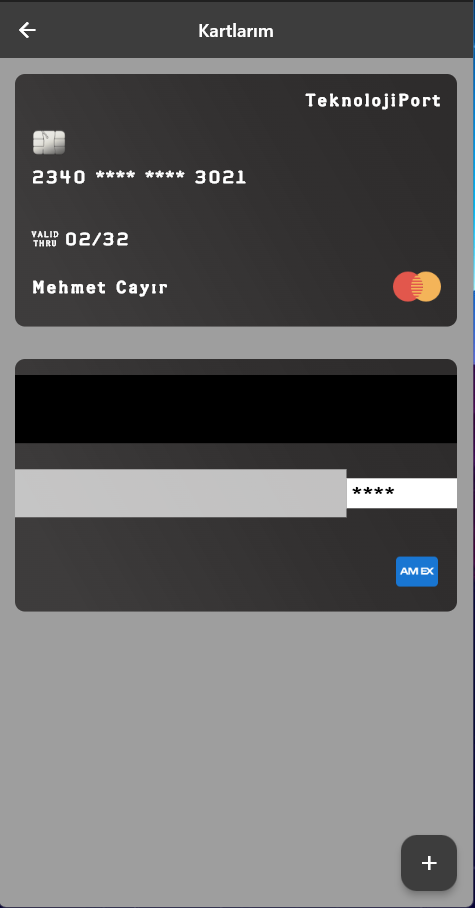
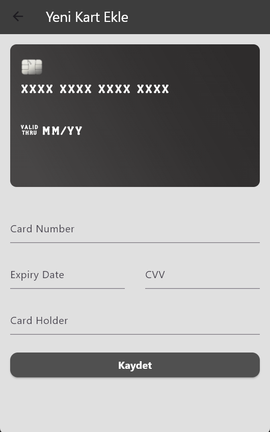

# 🏦 Flutter Cüzdan Uygulaması (TeknolojiPort)

Bu proje, Flutter kullanılarak geliştirilen basit bir **cüzdan uygulamasıdır**. Kullanıcılar kredi kartlarını uygulamaya ekleyebilir, kartları listeleyebilir ve kart bilgilerini görsel olarak görüntüleyebilir.

## 📸 Ekran Görüntüleri

| Kartlarım Sayfası | Kart Ekleme Sayfası |
|-------------------|---------------------|
|  |  |

## 🚀 Özellikler

- 💳 Kredi kartı ekleme formu
- 🎴 `flutter_credit_card` paketi ile şık kart gösterimi
- 🧾 Kartları listeleme
- 📱 Modern ve sade mobil arayüz
- 🌑 Koyu tema uyumlu tasarım

## 🛠️ Kullanılan Paketler

| Paket | Açıklama |
|-------|----------|
| [`flutter_credit_card`](https://pub.dev/packages/flutter_credit_card) | Kart tasarımı ve form alanları için kullanıldı |

## 🔧 Kurulum

